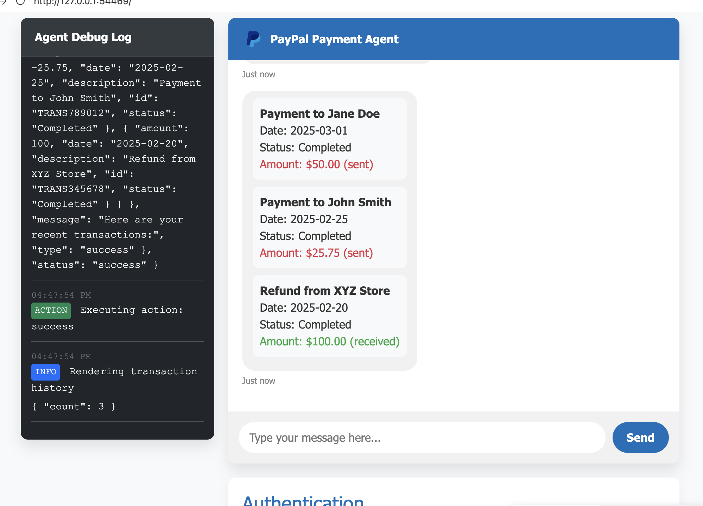
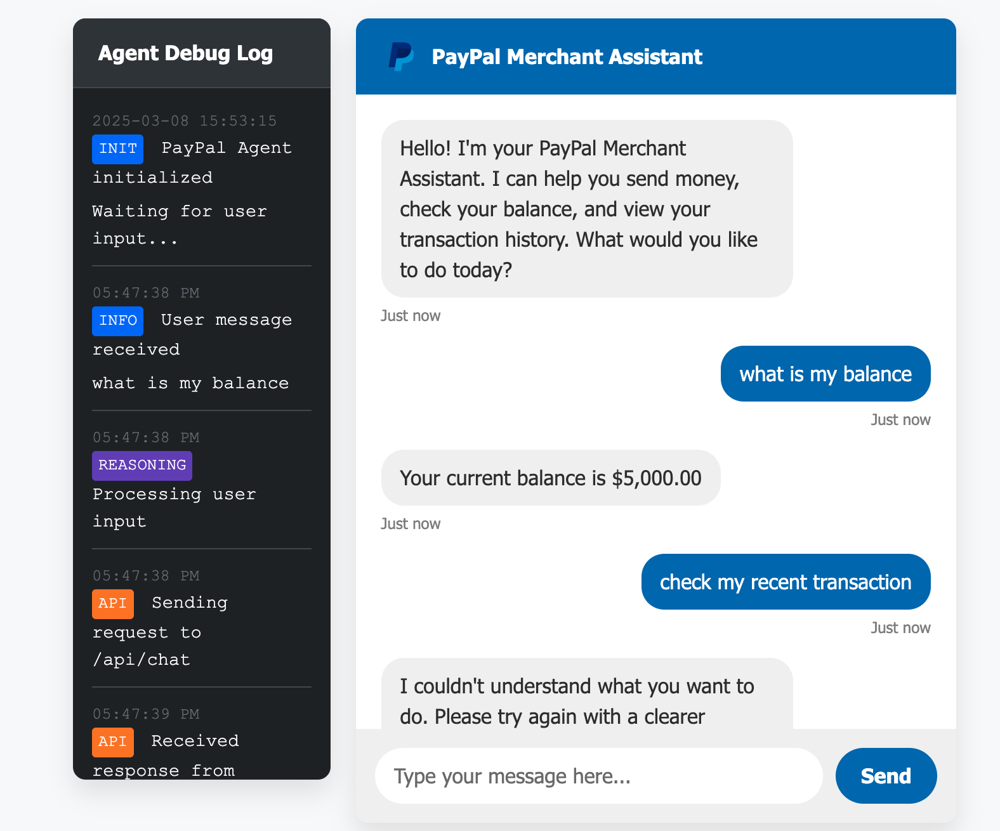

# PayPal Merchant Assistant

A conversational agent that uses the ReAct pattern to process natural language payment instructions and execute them through the PayPal API in **sandbox mode only**.

## User Interface

### Main Chat Interface


*The PayPal Merchant Assistant provides a chat interface for managing PayPal transactions and checking account information using the PayPal REST API in sandbox mode.*

### Debug Information Panel


*The debug panel shows detailed information about API calls, including endpoints, parameters, and responses.*

## Features

- **Enhanced ReAct Pattern**: Implements a reasoning and acting loop that allows for multiple function calls in sequence
- **Strict Sandbox Mode**: All PayPal API operations are strictly limited to sandbox mode with clear logging
- **Natural Language Processing**: Understand and process user commands like "send $20 to Alex" or "check my balance"
- **Autonomous API Selection**: The agent automatically decides which PayPal API to call based on the user's input
- **Chat Interface**: User-friendly chat interface with real-time feedback on API operations
- **Core PayPal Operations**: Support for sending money, checking balance, and viewing transaction history
- **Comprehensive Logging**: Two-tiered logging system with DEBUG logs for terminal and INFO logs for both terminal and UI

## Requirements

- Python 3.7+
- Flask 2.2.3
- PayPal SDK 1.13.1
- Other dependencies listed in requirements.txt

## Setup

1. Clone this repository
2. Install dependencies:
   ```
   pip install -r requirements.txt
   ```
3. Create a `.env` file with your PayPal API credentials:
   ```
   PAYPAL_CLIENT_ID=your_client_id_here
   PAYPAL_CLIENT_SECRET=your_client_secret_here
   PAYPAL_MODE=sandbox  # Use 'live' for production
   ```
4. Run the application:
   ```
   python app.py
   ```
5. Open your browser and navigate to `http://127.0.0.1:5000`

## Usage

1. Type natural language commands in the chat window:
   - "Send $50 to john@example.com"
   - "Check my balance"
   - "Show my recent transactions"

2. The agent will process your command, execute the appropriate PayPal API call, and respond with the result.

## How It Works

The agent uses an enhanced ReAct (Reasoning + Acting) pattern:

1. **Reasoning**: The LLM analyzes user input to understand intent and required actions
2. **Acting**: The agent executes PayPal API calls (in sandbox mode only) based on the LLM's reasoning
3. **Observation**: Results from API calls are fed back to the LLM for further reasoning
4. **Iteration**: The agent can make multiple function calls in sequence (up to 3) to complete complex tasks
5. **Response**: Provides a comprehensive response based on all API interactions

All operations are clearly marked with `[SANDBOX]` in logs to emphasize that they are running in sandbox mode only.

## Security Note

This application is designed to operate **exclusively in sandbox mode** and should never be used with real PayPal accounts or transactions. Key security features include:

- **Sandbox-Only Operations**: All PayPal API calls are restricted to sandbox mode
- **Environment Variable Protection**: API keys and credentials are stored in `.env` files (excluded from git)
- **Clear Logging**: All PayPal operations are clearly marked with `[SANDBOX]` in logs
- **Function Call Limits**: Maximum of 3 function calls per user request to prevent abuse

Additional security measures for a production environment would include:
- Secure user authentication
- API request validation
- Rate limiting
- Input sanitization
- Secure credential storage

## Development

To extend this agent:

1. **Add New Functions**: Register new functions in the `FunctionRegistry` class
2. **Update Function Schemas**: Add appropriate JSON schemas for new functions
3. **Implement Function Logic**: Create the actual function implementation in the appropriate adapter
4. **Update System Prompt**: Modify the system prompt in `config/settings.py` if needed

### Recent Enhancements

1. **ReAct Pattern Implementation**: Enhanced the agent to support multiple function calls in sequence
2. **Improved Logging**: Added comprehensive logging with `[SANDBOX]` prefix for all PayPal operations
3. **Conversation Management**: Updated the conversation history handling to properly support function calls
4. **Error Handling**: Improved error handling during function execution with user-friendly messages
